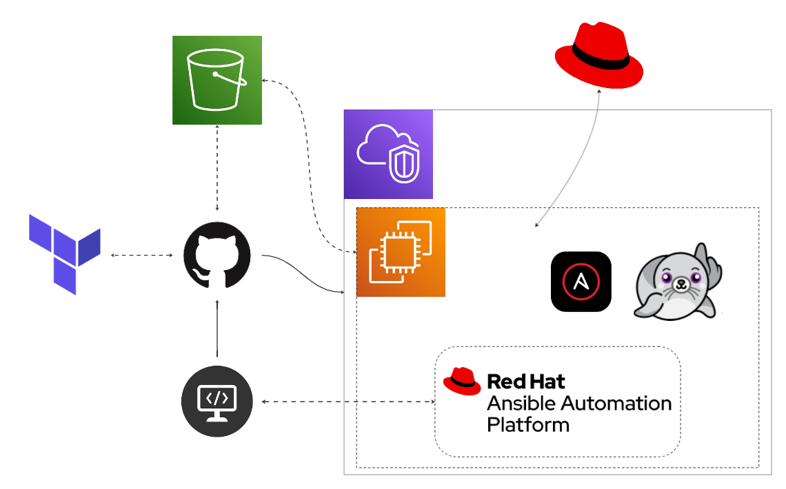

# Ansible Automation Platform 2.5 (Containerized)

## Terraform Infrastructure

### Summary

This project leverages Terraform to provision infrastructure and integrates GitHub Actions for streamlined automation. Key features include:

- A publicly accessible RHEL 9 EC2 instance running on AWS.
- Automated AWS infrastructure and instance configuration with Terraform.
- GitHub Actions workflows for:
  - Automatically creating a Terraform plan on a pull request.
  - Applying infrastructure changes upon pull request merge.

> **Note:** Familiarize yourself with all resources in the `terraform` directory, particularly `main.tf`.

---

### Architecture Diagram



   > **Note:**  
   - The ec2 details are defined, see `terraform` code in `main.tf`.  
---

### Implementation

#### Prerequisites

1. Fork this GitHub repository [Fork](https://github.com/r3dact3d/AAP-2.5-Containerized-on-AWS/fork)
2. Add the following secrets in the GitHub repository settings:  

   - `AWS_ACCESS_KEY`  
   - `AWS_SECRET_ACCESS_KEY`  
   - `ORG_ID` (Profile in [cloud.redhat.com](https://cloud.redhat.com))  
   - `ACTIVATION_KEY` (Created in **Inventory > System Configuration > Activation Keys** [console.redhat.com](https://console.redhat.com/insights/connector/activation-keys#SIDs=&tags=))  
   - `RHN_USER` (Red Hat Network username)  
   - `RHN_PASS` (Red Hat Network password)  
   - `AAP_PASS` (Default password for the initial inventory file)  

    

#### Procedure

1. **Gather Requirements**

- Review the Terraform configuration files in the `terraform` directory, particularly `main.tf`.

2. **Terraform Setup**

- Create a working branch to review and update files in the `terraform` directory as necessary:
  - main.tf
  - output.tf
  - user_data.txt
  
3. **SSH Key Management**

- Ensure your SSH public key is added to `user_data.txt`. This allows SSH access for maintenance or troubleshooting

4. **GitHub Actions Workflow**

- The GitHub Actions workflow requires a Pull-Request to the Ansible branch, which reviews and prints the Terraform Plan before merging

   > **Note:**  
   - DO NOT MERGE to `ansible` branch until you are happy with the terraform plan if you update anything in `terraform` directory the GitHub Actions Workflow will kick off.

5. **Instance Configuration**

- Review `remote-exec` custom code for specifics to configure ec2 instance in `main.tf`.
  - add additional packages to install here
  - Change AAP version
  - Update manifest file
  - Edit inventory
  > NOTE:
  > - AAP Bundle referenced in `remote-exec` can be downloaded from [access.redhat.com/downloads](https://access.redhat.com/downloads/content/480/ver=2.5/rhel---9/2.5/x86_64/product-software) and placed in `post-data` directory. *Then, look and update the code to reflect updated version.*

```bash
resource "null_resource" "hostname_update" {
  depends_on = [aws_instance.aap_instance]

  provisioner "remote-exec" {
    inline = [
      # Register Red Hat Host
      "sudo rhc connect --activation-key=<activation_key_name> --organization=<organization_ID>",
      
      # Ensure stuff is installed
      "sudo dnf install -y ansible-core wget git-core rsync vim",

      # Set hostname
      "sudo hostnamectl set-hostname ${aws_instance.aap_instance.public_dns}",

      # Download and extract the setup file
      "wget https://github.com/r3dact3d/AAP-2.5-Containerized-on-AWS/raw/refs/heads/ansible/post_data/ansible-automation-platform-containerized-setup-<AAP_VERSION>.tar.gz",
      "file ansible-automation-platform-containerized-setup-<AAP_VERSION>.tar.gz",
      "tar xfvz ansible-automation-platform-containerized-setup-<AAP_VERSION>.tar.gz",
      "sleep 45",

      # Setup SSH Keys
      "echo ${tls_private_key.cloud_key.private_key_pem} >> /home/ec2-user/.ssh/cloud_keys",
      "chmod 0644 /home/ec2-user/.ssh/cloud_keys",

      # Stage the manifest files
      "wget https://github.com/r3dact3d/AAP-2.5-Containerized-on-AWS/raw/refs/heads/ansible/post_data/manifest_AAP_Demo.zip",
      "sleep 15",

      # Configure inventory
      "cd ansible-automation-platform-containerized-setup-<AAP_VERSION>",
      "wget -O inventory-growth https://raw.githubusercontent.com/r3dact3d/AAP-2.5-Containerized-on-AWS/refs/heads/ansible/post_data/inventory-growth-custom",
      "sleep 15",
      "sed -i 's/<set your own>/new-install-password/g' inventory-growth",
      "sed -i 's/aap.example.org/${aws_instance.aap_instance.public_dns}/g' inventory-growth",
      "sed -i 's/<your RHN username>/rhn_user/g' inventory-growth",
      "sed -i 's/<your RHN password>/rhn_pass/g' inventory-growth",
      #"sed -i 's/<path_to_nfs_share>/${aws_efs_file_system.efs.dns_name}/g' inventory-growth",
      "sleep 15",

      "ansible-playbook -i inventory-growth ansible.containerized_installer.install -c local --private-key /home/ec2-user/.ssh/cloud_keys",
    ]
    
    
    connection {
      type        = "ssh"
      host        = aws_instance.aap_instance.public_ip
      user        = "ec2-user"
      private_key = tls_private_key.cloud_key.private_key_pem
    }
  }
}
```


### Post-Infrastructure: Validating AAP 2.5

5. **Review Terraform Outputs**  
   After the GitHub Actions workflow completes, retrieve instance details from the output.  
   - Use the public IP to SSH into the instance (`ec2-user`).

   Validate:  
   - Expected results from `user_data.txt`.  
   - Expected results from the provisioner in `main.tf`.  
   - Contents of the `ansible` directory and inventory details.

   

6. **Validate Ansible Automation Platform 2.5 (Containerized)**  

   From the machine with the corresponding SSH keys that were added to the `user_data.txt` :  

   ```bash
   ssh ec2-user@<public IP>

   cd ansible-automation-platform-containerized-setup-2.5-6
---

   > **Note:**  If we need/want to run the installer manually.
   >- nohup ansible-playbook -i inventory-growth ansible.containerized_installer.install -e ansible_connection=local &>/dev/null &
   >- Capture the PID of the ansible process started by nohup and run the `top` process to monitor the status.
   >- Also, creates a log in the working directory for review, but top will keep the session from timing out.  

## **Overview of the GitHub Actions Workflow**

The provided GitHub Actions workflow is designed to manage infrastructure changes using Terraform. It automates the process of planning and applying changes to infrastructure on Amazon Web Services (AWS) when code changes are pushed to the `ansible` branch or a pull request is created for that branch.

### **Trigger**

The workflow is triggered on two events:

* `push` to the `ansible` branch, with changes to files in the `terraform` directory
* `pull_request` to the `ansible` branch, with changes to files in the `terraform` directory

### **Environment Variables**

The workflow sets several environment variables:

* `TF_LOG`: sets the Terraform log level to `INFO`
* `AWS_ACCESS_KEY_ID` and `AWS_SECRET_ACCESS_KEY`: sets the AWS credentials using secrets stored in the GitHub repository
* `S3_BUCKET_NAME`: sets the name of the S3 bucket used for Terraform state storage
* `AWS_REGION`: sets the AWS region to `us-east-2`
* `AAP_VERSION`: sets the Ansible Automation Platform version to `2.5-9`

### **Job**

The workflow defines a single job named `terraform`, which runs on an `ubuntu-latest` environment.

### **Steps**

The job consists of the following steps:

1. **Checkout repository**: checks out the repository code to the runner
2. **Configure user_data and/or remote_exec provisioner**: replaces placeholders in the `main.tf` file with environment variables using Perl
3. **Check if S3 bucket exists**: checks if the specified S3 bucket exists, and creates it if it doesn't (with error handling)
4. **Create S3 bucket if it does not exist**: creates the S3 bucket if it was determined not to exist in the previous step
5. **Setup AWS credentials**: configures the AWS credentials using the `aws-actions/configure-aws-credentials` action
6. **Setup Terraform**: sets up Terraform with a specified version (1.3.0) using the `hashicorp/setup-terraform` action
7. **Terraform init**: initializes Terraform with the specified backend configuration
8. **Terraform validate**: validates the Terraform configuration
9. **Terraform plan**: generates a Terraform plan (only for pull requests)
10. **Terraform plan comment**: posts a comment to the pull request with the Terraform plan output (only for pull requests)
11. **Terraform Plan Status**: fails the job if the Terraform plan step fails
12. **Terraform Apply**: applies the Terraform configuration (only for push events to the `ansible` branch)

### **Conditional Logic**

The workflow uses conditional logic to determine which steps to execute based on the event type (push or pull request) and branch. For example:

* The `Terraform plan` step is only executed for pull requests.
* The `Terraform Apply` step is only executed for push events to the `ansible` branch.

Overall, this workflow automates the process of planning and applying changes to infrastructure on AWS using Terraform, with conditional logic to handle different event types and branches.